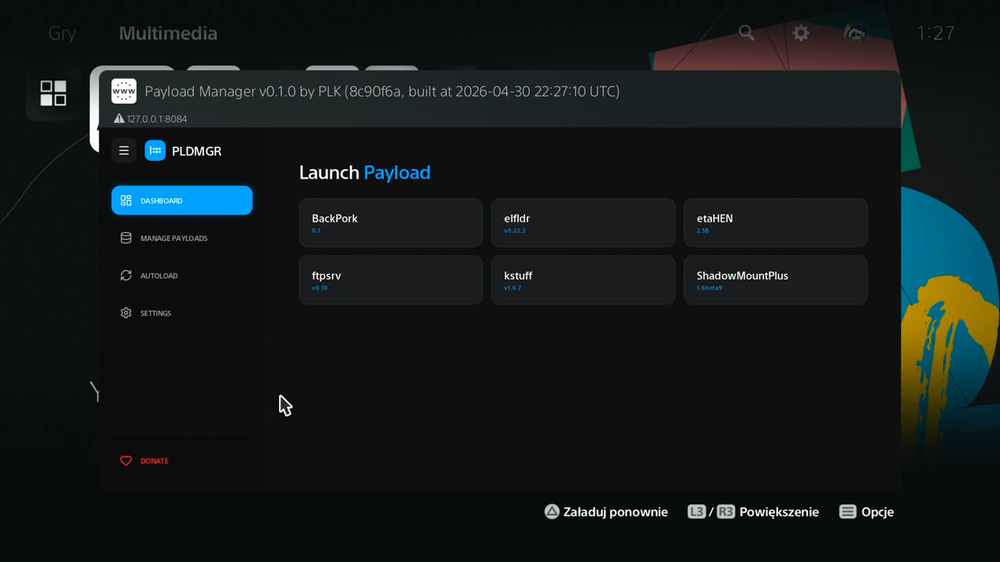

 

<h1 align="center">PS5 Payload Manager</h1>

A modern, web-based dashboard to easily manage, import, and automatically load payloads on your PS5.

 

## Features
- **Web-Based Interface**: A modern dashboard to manage payloads from your PC, phone, or the PS5 itself.
- **Import Payloads**: Easily add new payloads from a USB drive or download them from the cloud repository.
- **Automated Startup**: Set up a list of payloads to load automatically whenever you start the manager.
- **Home Screen Shortcut**: Installs a dedicated "Payload Manager" app icon to your PS5 home screen for quick access.
- **Auto-Close Disc Player**: Optional setting to automatically close the Disc Player on startup (useful for BD-JB users).

## Installation

### Using an Autoloader (Recommended)
It is highly recommended to use **Payload Manager** together with an **Autoloader**:

[Y2JB](https://github.com/itsPLK/ps5-y2jb-autoloader) | [BD-JB](https://github.com/itsPLK/ps5-bdjb-autoloader) | [Lua](https://github.com/itsPLK/ps5-lua-autoloader)

`pldmgr.elf` is already included as the default payload in the latest versions of the Autoloaders linked above.

If you are using an older version and don't want to update the entire autoloader, you can simply:
1. Place `pldmgr.elf` into your `autoload` directory.
2. Add `pldmgr.elf` as the only entry in your `autoload.txt` config file.

### Standalone / Manual Loading
You can also manually load the manager like any other `.elf` file. Grab the latest version from the [Releases](https://github.com/itsPLK/ps5-payload-manager/releases) page.

## Custom Repositories
You can add third-party payload repositories to the manager. To learn how to create your own repository JSON and host it, see the [Custom Repositories Guide](CUSTOM_REPOSITORIES.md).

## Credits
- [John Törnblom](https://github.com/john-tornblom) - for the [shell UI installer](https://github.com/ps5-payload-dev/ftpsrv/blob/master/install-ps5.c) and various payloads used as reference.
- [BenNoxXD](https://github.com/BenNoxXD) - for the [Disc Player App termination logic](https://github.com/BenNoxXD/PS5-BDJ-HEN-loader/blob/main/HENloader_C_part/src/kill_disc_player.c).
- [owendswang](https://github.com/owendswang) - for [contributions](https://github.com/itsPLK/ps5-payload-manager/commits/main/?author=owendswang)
- Everyone else contributing to the PS5 homebrew scene.

## Donations
If you'd like to support my work, please check out the [DONATE.md](DONATE.md) file.

## Development
For build instructions and deployment details, see [DEVELOPMENT.md](DEVELOPMENT.md).
